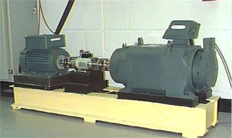
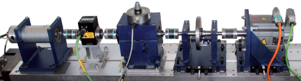
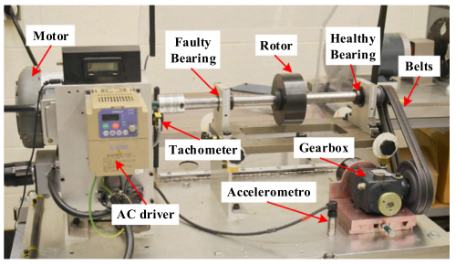
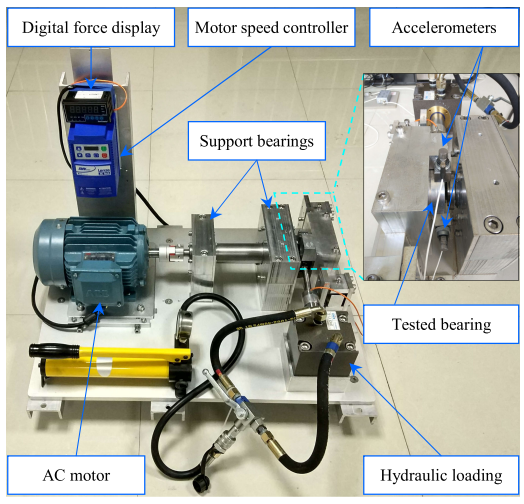
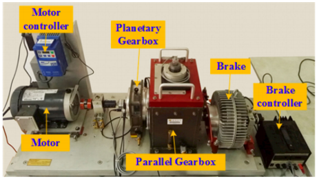
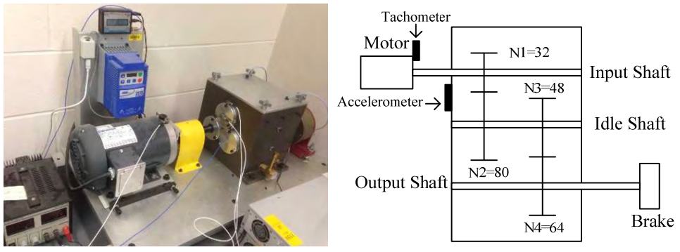

**故障诊断数据集目录**

<!-- TOC -->

- [1.美国-凯斯西储大学轴承数据中心轴承数据集](#1凯斯西储轴承数据集CWRU)
- [2.SUDA试验台数据集](#2SUDA轴承数据集)
- [3.美国-机械故障预防技术学会MFPT](#3美国-机械故障预防技术学会mfpt)
- [4.德国-帕德伯恩大学Paderborn轴承数据集](#4德国-帕德伯恩大学paderborn)
- [5.SDUST山东科技大学数据集](#5SDUST山东科技大学数据集)
- [6.SEU东南大学轴承数据集](#6SEU东南大学轴承数据集)
- [7.中国-上海交通大学轴承数据集](#7上海交通大学轴承数据集)
- [8.江南大学轴承数据集](#8江南大学轴承数据集)
- [9.加拿大-渥太华大学轴承数据集 ](#9加拿大-渥太华大学轴承数据集 )
- [10.意大利-都灵理工大学轴承数据DIRG_BearingData](#10意大利-都灵理工大学轴承数据DIRG_BearingData)
- [11.XJTU轴承寿命预测数据集](#11XJTU轴承寿命预测数据集)
- [12.东南大学齿轮箱数据集](#12东南大学齿轮箱数据集)
- [13.SUDA齿轮箱故障数据](#13SUDA齿轮箱故障数据)
- [14.美国-康涅狄格大学University of Connecticut](#14美国-康涅狄格大学University of Connecticut)
- [15.巴西-里约热内卢联邦大学 MAFAULDA](#15.巴西-里约热内卢联邦大学 MAFAULDA)

# 一.故障诊断数据集库介绍
​		故障诊断数据集库收集了故障诊断领域常用的轴承及齿轮箱数据集，对应每个数据集，整理了未处理的原始数据，包含数据读取及数据预处理功能的readdata.py文件，数据集说明文档及数据集相关文献。其中部分数据集的介绍参考了https://github.com/hustcxl/Rotating-machine-fault-data-set

# 二.轴承故障诊断数据集

## 1.[凯斯西储轴承数据集CWRU](./doc/CWRU.md)

----------------CWRU轴承数据集适用场景----------------

- 变工况条件下的迁移学习任务
- 仅包含单一故障，不适用于复合故障诊任务

   
         凯斯西储数据集包括四种轴承不同轴承健康状态，即**正常状态、内圈故障、外圈故障和滚动体故障**。分别有7mils、14mils和21mils**三种故障直径**（1mils=0.0254mm)。该电动机在0hp、1hp、2hp、3hp**四种不同的负载**和1730r/min、1750r/min、1772r/min、1797r/min**四种不同转速**下收集振动信号。 

| 负载 | 转速    | 轴承健康状态                             | 故障尺寸              |
| ---- | ------- | ---------------------------------------- | --------------------- |
| 0hp  | 1797rmp | 正常状态、内圈故障、外圈故障、滚动体故障 | 7mils、14mils、21mils |
| 1hp  | 1772rmp | 正常状态、内圈故障、外圈故障、滚动体故障 | 7mils、14mils、21mils |
| 2hp  | 1750rmp | 正常状态、内圈故障、外圈故障、滚动体故障 | 7mils、14mils、21mils |
| 3hp  | 1730rmp | 正常状态、内圈故障、外圈故障、滚动体故障 | 7mils、14mils、21mils |

## 2.SUDA轴承数据集 

​         ----------------SUDA轴承数据集适用场景----------------

- 变工况条件下的迁移学习任务
- 包含四种复合故障，适用于复合故障诊任务

​		SUDA试验台数据轴承故障数据分别在0kN、1kN、2kN、3kN四种电机负载状态下以10kHz的采样频率采集，构建了多种负载的轴承故障数据文件，其中包含正常状态轴承数据和故障轴承数据。轴承故障类型包括三种单一故障(IF、OF、BF)和四种复合故障(IO、IB、OB、IOB)，单一故障分别有0.2mm、0.3mm、0.4mm、0.5mm、0.6mm五种故障尺寸，复合故障尺寸均为0.2mm。

| 负载 | 转速     | 轴承健康状态                                                 | 故障尺寸                          |
| ---- | -------- | ------------------------------------------------------------ | --------------------------------- |
| 0hp  | 896.1rmp | 正常状态、内圈故障、外圈故障、滚动体故障、四种复合故障(IO、IB、OB、IOB) | 0.2mm、0.3mm、0.4mm、0.5mm、0.6mm |
| 1hp  | 896.1rmp | 正常状态、内圈故障、外圈故障、滚动体故障、四种复合故障(IO、IB、OB、IOB) | 0.2mm、0.3mm、0.4mm、0.5mm、0.6mm |
| 2hp  | 896.1rmp | 正常状态、内圈故障、外圈故障、滚动体故障、四种复合故障(IO、IB、OB、IOB) | 0.2mm、0.3mm、0.4mm、0.5mm、0.6mm |
| 3hp  | 896.1rmp | 正常状态、内圈故障、外圈故障、滚动体故障、四种复合故障(IO、IB、OB、IOB) | 0.2mm、0.3mm、0.4mm、0.5mm、0.6mm |

## 3.[美国-机械故障预防技术学会MFPT](./doc/MFPT.md)

----------------MFTP轴承数据集适用场景----------------

- 变工况条件下的迁移学习任务
- 仅包含单一故障，不适用于复合故障诊任务

  

 	    机械故障预防技术协会(MFPT)数据集包括**三种轴承不同轴承健康状态，即正常状态、内圈故障、外圈故障**。根据不同的工作状况, 数据集收集了采样率为 97 656 Hz 的 270 磅（lb）负载下的基线条件下的 3 个健康数据和 3 个外圈故障数据。此外还有在 25，50，100，150，200，250 和 300 磅负载下的 7 个外圈故障数据和在 0，50，100，150，200，250 和 300 磅负载下的 7 个内圈故障数据。数据由以下几部分组成 :

  -  3 种健康数据对应的工作条件：270 lbs负载，25 Hz 输入轴速率，97,656 sps 采样率，采样 6 秒。

  -  3 种外圈故障对应的工作条件：270 lbs 负载，25 Hz 输入轴速率，97,656 sps 采样率，采样 6 秒。

  -  外圈故障数据对应的7 种工作条件：25、50、100、150、200、250 和 300 lbs 负载，输入轴速率 25 Hz，采样率为 48,828 sps，采样 3 秒

  -  内圈故障数据对应的7 种工作条件：0、50、100、150、200、250 和 300 lbs 负载，输入轴速率 25 Hz，采样速率 48,828 sps，采样 3 秒。

    使用MFPT数据集的论文：

    * Sobie C, Freitas C, Nicolai M. Simulation-driven machine learning: Bearing fault classification[J]. Mechanical Systems and Signal Processing, 2018, 99: 403-419. [论文链接](https://www.sciencedirect.com/science/article/pii/S0888327017303357)

    * Li H, Zhao J, Liu J, et al. Application of empirical mode decomposition and Euclidean distance technique for feature selection and fault diagnosis of planetary gearbox[J]. Journal of Vibroengineering, 2016, 18(8).[论文链接](http://web.b.ebscohost.com/ehost/detail/detail?vid=0&sid=8cbc911d-7aff-49ef-8ba4-b2665a2fcf1f%40pdc-v-sessmgr03&bdata=Jmxhbmc9emgtY24mc2l0ZT1laG9zdC1saXZl#AN=120525722&db=aph)

    * Barbini L, Ompusunggu A P, Hillis A J, et al. Phase editing as a signal pre-processing step for automated bearing fault detection[J]. Mechanical Systems and Signal Processing, 2017, 91: 407-421.[论文链接](https://www.sciencedirect.com/science/article/pii/S0888327016305192#b0095)

    

## 4.[德国-帕德伯恩大学Paderborn](./doc/Paderborn.md)

----------------PU轴承数据集适用场景----------------

- 变工况条件下的迁移学习任务
- 包含复合故障，适用于复合故障诊任务
- 包含人工制作的故障及真实故障轴承

  
        

​		PU数据集由德国帕德博恩大学Christian Lessmeier 等人提供，用于数据驱动的轴承故障诊断。数据集所使用的轴承包括**人工加工而成的故障轴承**、加速寿命测试造成的**真实故障轴承**以及**健康轴承**。数据集共包含26种轴承损伤状态和6种健康状态的数据、以高频率同步采集了电机电流信号和振动信号。每种类别的轴承都在如下表所示的四种转速和荷载不同的工况下进行了数据采集。

| 工况编号 | 转速 [rpm] | 负载 [Nm] | 径向力 [N] | 数据名前缀  |
| :------: | :--------: | :-------: | :--------: | :---------: |
|    0     |    1500    |    0.7    |    1000    | N15_M07_F10 |
|    1     |    900     |    0.7    |    1000    | N09_M07_F10 |
|    2     |    1500    |    0.1    |    1000    | N15_M01_F10 |
|    3     |    1500    |    0.7    |    400     | N15_M07_F04 |

## 5.SDUST山东科技大学数据集

----------------SDUST轴承数据集适用场景----------------

- 变工况条件下的迁移学习任务
- 包含一种复合故障

​	    SDUST数据集是在不同速度下收集得到的数据集。图1显示了所采用的实验设备。轴承座的振动信号由带振动传感器的LMS数据采集仪采集，采样频率为25.6 kHz。发动机转速为2000 r/min，圆柱滚子轴承型号为N205EU。数据集共包含四种健康状态，即正常、内圈故障、外圈故障、滚动体故障。每种类型的故障都有三种损伤尺寸，具体为**0.2 mm, 0.4 mm和0.6mm**，一共有**10种类型的数据**，即N、I0.2、I0.4、I0.6、O0.2、O0.4、O0.6、R0.2、R0.4、R0.6。在**四种不同负载采集了六个转速下的数据**，即500、1000、1500、2000、2500、3000转/分钟。

| 转速    | 轴承健康状态                         | 故障尺寸            |
| ------- | ------------------------------------ | ------------------- |
| 500rmp  | 正常、内圈故障、外圈故障、滚动体故障 | 0.2mm、0.4mm、0.6mm |
| 1000rmp | 正常、内圈故障、外圈故障、滚动体故障 | 0.2mm、0.4mm、0.6mm |
| 1500rmp | 正常、内圈故障、外圈故障、滚动体故障 | 0.2mm、0.4mm、0.6mm |
| 2000rmp | 正常、内圈故障、外圈故障、滚动体故障 | 0.2mm、0.4mm、0.6mm |
| 2500rmp | 正常、内圈故障、外圈故障、滚动体故障 | 0.2mm、0.4mm、0.6mm |
| 3000rmp | 正常、内圈故障、外圈故障、滚动体故障 | 0.2mm、0.4mm、0.6mm |

## 6.SEU东南大学轴承数据集

​		----------------SEU轴承数据集适用场景----------------

- 不同负载条件下的迁移学习任务
- 包含一种复合故障

​		SEU轴承数据集是从传动系统动态模拟器(DDS)中收集的。在转速系统负载设置为**20HZ-0V或30HZ-2V**的两种不同的工作条件下采集得到。轴承的不同故障类型详见表1。该数据集包含**4种轴承故障状态**和1种健康状态。轴承故障状态分别为**滚动体上出现裂纹, 内圈出现裂纹, 外圈出现裂纹, 内圈和外圈都出现裂纹**。

| 故障类型    | 故障描述             | 负载情况         |
| ----------- | -------------------- | ---------------- |
| Normal      | 正常                 | 20HZ-0V、30HZ-2V |
| Ball        | 滚动体上出现裂纹     | 20HZ-0V、30HZ-2V |
| Inner       | 内圈出现裂纹         | 20HZ-0V、30HZ-2V |
| Outer       | 外圈出现裂纹         | 20HZ-0V、30HZ-2V |
| Combination | 内圈和外圈都出现裂纹 | 20HZ-0V、30HZ-2V |

## 7.上海交通大学轴承数据集

* 数据链接：(http://mad-net.org:8765/explore.html?t=0.08906464297121186)

* 相关论文

(1)Zhu LM, Ding H, Zhu XY. Synchronous Averaging of Time-frequency Distribution with Application to Machine Condition Monitoring. Trans of the ASME, Journal of Vibration and Acoustics, 2007, 129(4): 441-447. [link](https://asmedigitalcollection.asme.org/vibrationacoustics/article/129/4/441/446861/Synchronous-Averaging-of-Time-Frequency)

(2)Zhu LM, Ding H, Zhu XY. Extraction of Periodic Signal without External Reference by Time Domain Average Scanning. IEEE Trans. On Industrial Electronics, 2008, 55(2): 918-927.[link](https://ieeexplore.ieee.org/document/4444615) 

## 8.江南大学轴承数据集

----------------江南大学轴承数据集适用场景----------------

- 不同负载条件下的迁移学习任务
- 仅包含单一故障，不适用于复合故障诊任务

​		江南大学数据集包括四种轴承不同轴承健康状态，即**正常状态(N)、内圈故障(IB)、外圈故障(OB)和滚动体故障(TB)。**实验所用电动机**600r/min、800r/min、1000r/min**三种不同转速下收集振动信号。振动信号通过数据记录仪采集得到，采样频率为50kHz，功率和转速通过扭矩传感器测得。

| 故障类型 | 故障描述   | 负载情况                      |
| -------- | ---------- | ----------------------------- |
| Normal   | 正常       | 600r/min、800r/min、1000r/min |
| tb       | 滚动体故障 | 600r/min、800r/min、1000r/min |
| ib       | 内圈故障   | 600r/min、800r/min、1000r/min |
| ob       | 外圈故障   | 600r/min、800r/min、1000r/min |

## 9.加拿大-渥太华大学轴承数据集  

----------------渥太华大学轴承数据集适用场景----------------

- 不同负载条件下的迁移学习任务
- 仅包含单一故障，不适用于复合故障诊任务

 

​		该数据包含在时变转速条件下从不同健康状况的轴承收集的振动信号。总共有36个数据集。对于每个数据集，有两个实验设置：轴承健康状况和变化速度条件。  轴承的健康状况包括:  （i）健康，  （ii）内圈缺陷有缺陷，以及   （iii）外圈缺陷有缺陷。  
操作转速条件是:   （i）增加速度，  （ii）减小速度，  （iii）增加然后减小速度，以及  （iv）减小然后增加速度。  
因此，设置有12种不同的情况。为了确保数据的真实性，每个实验设置收集3个试验，总共产生36个数据集。  每个数据集包含两个通道：   'Channel_1' 是由加速度计测量的振动数据，'Channel_2'是由编码器测量的转速数据。  所有这些数据都以200,000Hz采样，采样持续时间为10秒。

  * 论文链接：(https://www.sciencedirect.com/science/article/pii/S2352340918314124?via%3Dihub)
  * 数据链接：(https://data.mendeley.com/datasets/v43hmbwxpm/1)
  * 已经发表的论文：[Bearing fault diagnosis under unknown time-varying rotational speed conditions via multiple time-frequency curve extraction](https://www.sciencedirect.com/science/article/pii/S0022460X17307678?via%3Dihub)
  * [A method for tachometer-free and resampling-free bearing fault diagnostics under time-varying speed conditions](https://www.sciencedirect.com/science/article/pii/S026322411831011X)

 ## 10.意大利-都灵理工大学轴承数据DIRG_BearingData

  

​		 在都灵理工大学机械和航空航天工程系 DIRG实验室设置的钻机收集的数据，专门用于测试高速航空轴承，其加速度采集在可变转速，径向载荷和损伤水平，与温度测量一起，可作为开放存取数据提供。

 * 数据链接:(ftp://ftp.polito.it/people/DIRG_BearingData/)
 * 论文链接:[The Politecnico di Torino rolling bearing test rig: Description and analysis of open access data](

# 三.轴承寿命预测数据集

## 11.[XJTU轴承寿命预测数据集](./doc/XJTU_SY.md)

----------------XJTU轴承寿命预测数据集适用场景----------------

- 加速度寿命预测任务

​		轴承加速寿命测试平台由交流电动机、电动机转速控制器、转轴、支撑轴承、液压加载系统和测试轴承等组成，可以开展各类滚动轴承或滑动轴承在不同工况下的加速寿命试验，获取测试轴承的全寿命周期监测数据。

​		  

​		试验轴承为 LDK UER204 滚动轴承，其相关参数见表 1。试验共设计了 **3** **类工况，分别为2100r/min、2250r/min、2400r/min、1797r/min三种不同转速**, 如表 2 所示，**每类工况下有** **5 个轴承**。为了获取轴承的全寿命周期振动信号，两个 PCB 352C33 单向加速度传感器分别通过磁座固定于测试轴承的水平和竖直方向上。试验中使用 DT9837 便携式动态信号采集器采集振动信号。试验中设置采样频率为 25.6 kHz，采样间隔为 1 min，每次采样时长为1.28 s。表3 给出了每一个测试轴承的详细信息，包括其对应的工况、数据样本总数、基本额定寿命 L10、实际寿命和失效位置。

# 四.齿轮箱故障诊断数据集

## 12.[东南大学齿轮箱数据集](./doc/SEU.md)

----------------东南大学齿轮箱数据集适用场景----------------

- 不同负载条件下的迁移学习任务

 

​		SEU齿轮箱数据集是从图1所示的传动系统动态模拟器(DDS)中收集的。在转速系统负载设置为20HZ-0V或30HZ-2V的两种不同的工作条件下采集得到。在每个文件中，有8行信号，分别代表： 1——电机振动、2、3、4——x、y和z三个方向上行星齿轮箱的振动信号、5——电机扭矩、6、7、8——x、y和z三个方向上并联齿轮箱的振动信号。齿轮箱的不同故障类型详见表1。**该数据集包含4种齿轮故障状态和1种健康状态。**齿轮故障状态分别为**齿轮底部出现裂纹, 齿轮缺失一个齿, 齿轮根部出现裂纹, 齿轮表面出现磨损。**每种故障类型包括1000个用于训练的样本, 测试数据集与训练数据集的大小相同。

github连接：https://github.com/cathysiyu/Mechanical-datasets

论文：**“Highly Accurate Machine Fault Diagnosis Using Deep Transfer Learning”**  

| 故障类型 | 故障描述         | 负载情况         |
| -------- | ---------------- | ---------------- |
| Normal   | 正常             | 20HZ-0V、30HZ-2V |
| Chipped  | 齿轮底部出现裂纹 | 20HZ-0V、30HZ-2V |
| Miss     | 齿轮缺失一个齿   | 20HZ-0V、30HZ-2V |
| Root     | 齿轮根部出现裂纹 | 20HZ-0V、30HZ-2V |
| Surface  | 齿轮表面出现磨损 | 20HZ-0V、30HZ-2V |

## 13.SUDA齿轮箱故障数据

​		SUDA齿轮箱数据集包括四种故障类别的数据, 下图待测齿轮箱实验台，其中测试齿轮为斜齿轮。测试轴承为型号30206的圆锥滚子轴承。在待测主动轮轮齿上通过线切割模拟齿轮断齿故障，为减小传递路径的影响，将型号为PCBM621B40的振动加速度传感器置于靠近故障轴承的箱盖上，另一端与型号为INV3018C的信号采集仪相连测取齿轮箱故障振动信号，采集仪另一端与电脑相连，最终由电脑输出采集到的振动信号。测试直流电机转速为1480r/min，通过计算齿轮冲击性故障对应的故障特征频率分别为24.67Hz和176.18Hz。

| 故障类型 | 故障描述 | 转速      |
| -------- | -------- | --------- |
| mw       | 中度磨损 | 1480r/min |
| sw       | 轻度磨损 | 1480r/min |
| ng       | 正常     | 1480r/min |
| bt       | 断裂齿   | 1480r/min |

## 14.[美国-康涅狄格大学University of Connecticut](./doc/Connecticut.md)

  

 由美国康涅狄格大学唐炯教授团队分享。齿轮箱故障数据。

 * https://www.sciencedirect.com/science/article/pii/S0888327018306800?via%3Dihub)

 ## 15.巴西-里约热内卢联邦大学 MAFAULDA
      
 * 数据链接：(http://www02.smt.ufrj.br/~offshore/mfs/page_01.html)
 * Marins M A, Ribeiro F M L, Netto S L, et al. Improved similarity-based modeling for the classification of rotating-machine failures[J]. Journal of the Franklin Institute, 2018, 355(4): 1913-1930.[论文链接](https://www.sciencedirect.com/science/article/pii/S0016003217303678)
 * Saufi S R, bin Ahmad Z A, Leong M S, et al. Differential evolution optimization for resilient stacked sparse autoencoder and its applications on bearing fault diagnosis[J]. Measurement Science and Technology, 2018, 29(12): 125002. [论文链接](https://iopscience.iop.org/article/10.1088/1361-6501/aae5b2/meta)

## 
